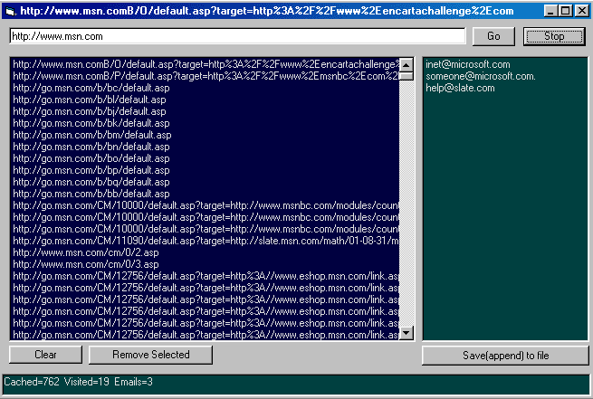



## EmailExtractor1

### Description

Crawls through urls extracting unique Email addresses as it goes.

This version only follows href tags, and does

limited relative path to full path conversion

i.e it does not properly folow relative links having ../

I will post a new version soon that extracts all

urls and has better relative path support.

Code is heavily commented and Shows how to use:

regular expressions

inet control

dictionary objects

listboxes
 
### More Info
 
Just give it a starting URL and press go

Must have reference to

Regular expresions and Scripting runtime

I recomend regular expresions 5.5 which you will find the download link to in the global declarations

A list of email addresses that can then be saved/appended to a text file

although I limit cashed URLS to 5000 this script can cunsume quite a bit of memory.

It would be much better to use a DB to Cash URLs

and Emails (less memory) and this would also allow

cach to exist between program invocations, but for this simple demo I used listboxes.

             |
---                |---
**Submitted On**   |2001-09-01 14:27:32
**By**             |[RegX](https://github.com/Planet-Source-Code/PSCIndex/blob/master/ByAuthor/regx.md)
**Level**          |Advanced
**User Rating**    |4.8 (29 globes from 6 users)
**Compatibility**  |VB 6\.0
**Category**       |[Internet/ HTML](https://github.com/Planet-Source-Code/PSCIndex/blob/master/ByCategory/internet-html__1-34.md)
**World**          |[Visual Basic](https://github.com/Planet-Source-Code/PSCIndex/blob/master/ByWorld/visual-basic.md)
**Archive File**   |[EmailExtra25738912001\.zip](https://github.com/Planet-Source-Code/regx-emailextractor1__1-26878/archive/master.zip)

